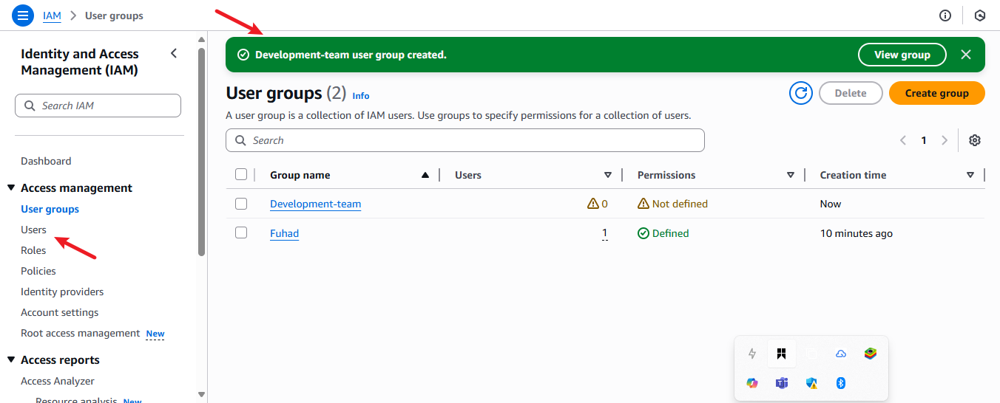
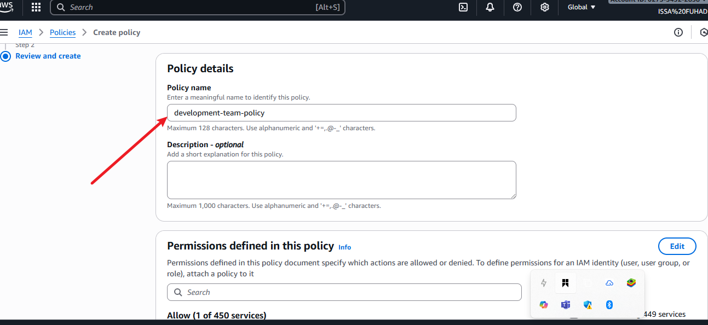

## NAME:- ISSA FUHAD
## PROJECT:- AWS Cloud Computing

# 🚀 AWS IAM Setup Guide

This guide walks you through the process of setting up IAM users, groups, and policies in the AWS Management Console using a series of screenshots. Follow each step to configure access permissions for your development team.

---

## 📂 Prerequisites

- AWS account with admin privileges
- Access to AWS Management Console
- Authentication app (e.g., Google Authenticator) for MFA setup

---

## 🧭 Step-by-Step Instructions

### 1. Access IAM Console
- `1.Login_and_navigate_you_AWS_console.png`

- `2.Search_for_IAM_and_click_to_visit_the_page.png`

- `3.Click_on_the_policies_icon.png`

### 2. Create EC2 Policy
- `4.Search_for_ec2_and_grant_full_access_to_Amazon.png`

- `5.Click_the_create_policy_icon.png`

- `6.Search_for_ec2_and_confirm.png`

- `7.It_brings_you_here_and_you_confirm_the_All_EC2_action.png`

- `8.Under_the_resources_click_all_and_then_next.png`

- `9.Add_policy_name_and_description.png`

- `10.Scroll_down_and_create_policy.png`

- `11.Policy_sucessfully_created.png`

### 3. Create IAM Users
- `12.Click_on_user_to_create_user.png`

- `13.Click_the_create_user.png`

- `14.Input_username_and_confirm_to_be_an_IAM_user.png`

- `15.Set_custom_password_to_create_and_new_password_and_click_next.png`

- `16.Click_attach_policies_directly_and_click_the_next_icon.png`

- `17.Review_and_create.png`

- `18.User_Fuhad_created_sucessfully_and_download_the_CVS_file_to_retreive_choose_passwords.png`

- `19.Download_sucessful_the_proceed_to_user_list_page.png`

### 4. Create User Group
- `20.Click_on_user_groups.png`

- `21.Click_on_the_create_group_icon.png`

- `22.Set_group_name_and_scroll_down_to_clcik_create_group.png`

- `23.Group_sucessfully_created_click_user_to_create_new_user.png`

### 5. Add Users to Group
- `24.User_list_page_appears_then_click_create_user.png`

- `25.Choose_user_name_and_click_next.png`

- `26.Choose_add_user_to_group_and_select_the_group_then_click_next.png`

- `27.Review_and_click_create_user.png`

- `28.User_JACK_sucessfully_created.png`

- `29.Create_another_user_by_clicking_create_user.png`

- `30.Choose_username_and_click_next.png`

- `31.Select_the_group_name_and_click_next.png`

- `32.Review_and_click_create_user.png`

- `33.User_Ade_sucessfully_added.png`

### 6. Attach Policies to Group
- `34.Click_policies_to_create_new_policy_for_the_group.png`

- `35.Click_Create_policy.png`

- `36.Choose_EC2_and_click_all_EC2_actions.png`

- `37.Select_add_more_permission_and_select_S3_service.png`

- `38.Click_next.png`

- `39.Name_the_policy_and_scroll_down_to_choose-create_policy.png`

- `40.It_has_been_sucessfully_ceeated_navigate_to_the_user_group.png`

- `41.Click_Development_team.png`

- `42.Choose_permission_and_click_on_attach_policies.png`

- `43.On_policy_named_list_click_here_and-choose_custome_managed.png`

- `44.Select_development_team_policy_and_click_the_attach_policies.png`

- `45.Policy_sucessfully_attached.png`

### 7. Enable MFA for Users
- `46.Click_user_to_manage_users.png`

- `47.Click_on_Fuhad.png`

- `48.Click_on_security_credential_and_assign_MFA.png`

- `49.Enter_device_name_and_choose_authentication_option.png`

- `50.Show_QR_Code_And_scan_Qr_code_on_the_authentication_app.png`

---

## ✅ Completion

You’ve now successfully:
- Created IAM users and groups
- Assigned custom policies
- Enabled MFA for added security

---

## 📌 Notes

- Always download and securely store user credentials.
- Use groups to manage permissions efficiently.
- Enable MFA for all users to enhance account security.

---

## 🛡️ License

This guide is for internal use and educational purposes only.
